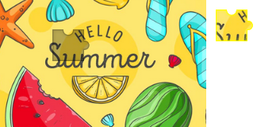
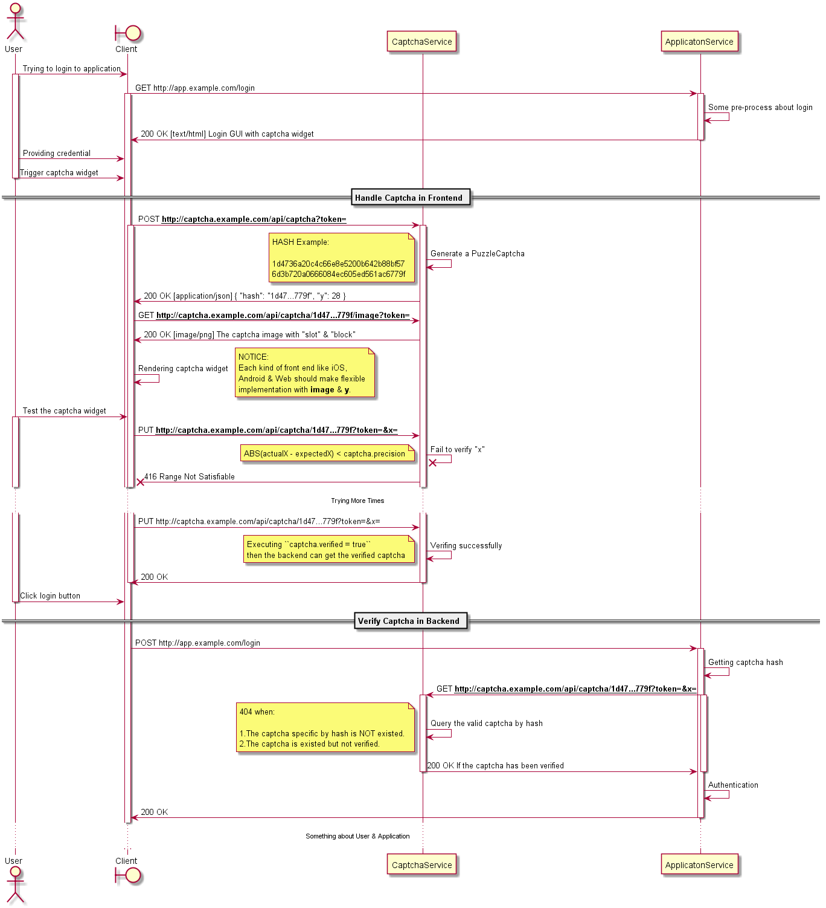
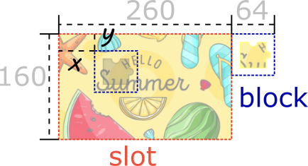

Puzzle-captcha
==================

这是一个独立运行的高性能“拼图行为验证码”服务。

## 环境

由于使用了Electron，所以需要在非桌面环境下安装虚拟显示服务，包括Xvfb和有关图形的动态链接库。

```
$ yum install Xvfb pango.x86_64 libXcomposite.x86_64 libXcursor.x86_64 libXdamage.x86_64 libXext.x86_64 libXi.x86_64 libXtst.x86_64 cups-libs.x86_64 libXScrnSaver.x86_64 libXrandr.x86_64 GConf2.x86_64 alsa-lib.x86_64 atk.x86_64 gtk3.x86_64 -y
```

启动命令，
```
+ Xvfb :99 -ac 2>/dev/null &
+ export DISPLAY=:99
+ npm start
```

### 服务配置

从``/example``复制，创建``/public``：
```bash
cp ./example ./public -a
```

``/public``的目录结构：
```
[root@localhost puzzle-captcha]# tree ./public/
./public/
├── config.json # 服务配置文件
├── preset # 原始图片素材 260x160
│   ├── 356a192b7913b04c54574d18c28d46e6395428ab.png
│   ├── 40bd001563085fc35165329ea1ff5c5ecbdbbeef.png
│   ├── 7b52009b64fd0a2a49e6d8a939753077792b0554.png
│   ├── 9fe2839c7d19fe2511ef5cc3d63bd475b139fc83.png
│   └── ac1ab23d6288711be64a25bf13432baf1e60b2bd.png
└── principal.json # Access Token配置
```

#### ``/public/config.json`` - 服务配置文件，

```json
{
	"api": {
		"port": 80
	},
	"captcha": {
		"bufferSize": 4000,
		"precision": 5
	}
}
```

* api.port - Http监听端口
* captcha.bufferSize - 验证码成品缓冲队列长度，建议 4000 - 25000
* captcha.precision - 验证横坐标数值的允许误差（px）(``abs(actual - expected) < captcha.precision``)

#### ``/public/principal.json`` - 账户配置文件，
```json
{
	"4a20158f9cf975793d457ccb5a5ea6f30aa7f30caaa1f6771bf656506d584fe7": {}
}
```
目前根据需求随意增加新条目即可。


#### ``/public/preset/*.png`` - 验证码生成素材

该服务将为每一个原始图片素材创建一个专用的图形处理进程。可以任意增加原始图片，图片规格260x160

## Client

关于整体的API，一共4个接口：
- 为应用后端：1.验证指定hash所代表的验证码是否已经通过验证
- 为应用前端：1.创建一个验证码；2.获取指定hash的验证码的图片素材；3.回答该验证码的x值

以下所有接口必须携带正确的Token值，否则全部``403``

### Application Frontend

#### POST /api/captcha?token=&lt;AccessToken>

* 描述 - 创建一个验证码
* 响应
	- 200 - 获取新创建的验证码，Content-Type: application/json
		```json
		{
			"hash": "d462f80d96707e3e8bc637a3ffa74efc933fa6ec222a03b4cb6352827c390615",
			"y": 25
		}
		```
		hash - 验证码的hash；y - 用于各个平台前端渲染时的Y轴偏移
	- 429 - 当前缓冲队列没有可用的验证码资源


#### GET /api/captcha/{:hash}/image?token=&lt;AccessToken>

* 描述 - 获取指定hash验证码的图片资源，``hash``来自于``POST /api/captcha``接口
* 响应
	- 200 包含“槽”和“块”内容的合并图片，Content-Type: image/png

		
	- 404 根据hash找不到验证码

#### PUT /api/captcha/{:hash}/image?token=&lt;AccessToken>&x=&lt;offsetX>

* 描述 - 验证由hash指定的验证码答案，x就是答案，必须是一个整型数
* 响应
	- 200 - 验证的结果正确（响应Payload可以忽略）
	- 400 - 所提供的x无法被视作合法的整型数（响应Payload可以忽略）
	- 416 - 所提供的x值超出误差范围（响应Payload可以忽略）

### Application Backend

对于应用服务后端来说，对应业务请求里如果包含验证码的hash，则只需要查询该hash所指的验证码是否已被验证。

#### GET /api/captcha/{:hash}?token=&lt;AccessToken>

* 描述 - 查询由hash指定的验证码是否被成功验证
* 响应
	- 200 - 已经验证成功（响应Payload可以忽略）
	- 404 - 该验证码不存在或尚未验证成功（响应Payload可以忽略）

## 通讯时序

以下给出通讯时序图以帮助理解



## 尺寸关系

为了帮助各平台前端尽快理解如何处理验证图像，以下给出上述例子的尺寸示意

